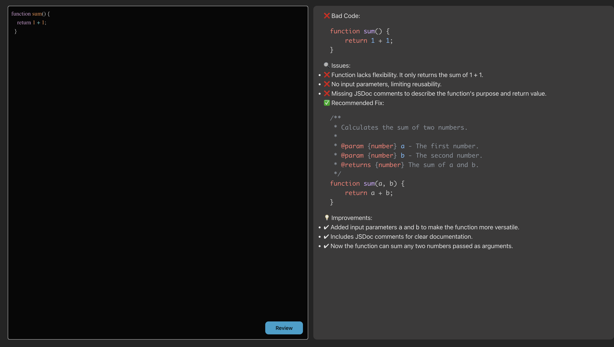

# CodeGenie: Your AI-Powered Code Review Assistant

CodeGenie is a cutting-edge code review tool designed to streamline the feedback process for developers.  It leverages the power of Google Gemini API 2.0 to provide intelligent and insightful code reviews, helping developers identify potential issues and improve the quality of their code.

## How it Works

The CodeGenie workflow is simple and efficient:

1. **Code Submission:** A developer posts their code and requests a review.

2. **Gemini API Request:** CodeGenie receives the code and sends a request to the Google Gemini API 2.0. This request includes the code snippet and any relevant context (e.g., programming language, project guidelines).

3. **Gemini Processing:** The Gemini API processes the code, analyzing it for potential errors, style inconsistencies, security vulnerabilities, and areas for improvement.

4. **Response and Feedback:** Gemini sends back a detailed response containing its analysis of the code.

5. **Review Delivery:** CodeGenie parses the response from Gemini and presents it to the developer in a clear and user-friendly format. The feedback highlights specific areas in the code where corrections or improvements can be made, along with explanations and suggestions.

